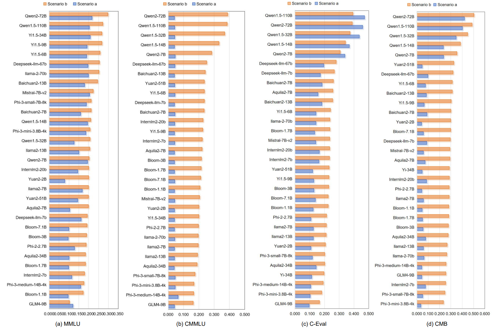

# Benchmark-leakage-detection
Benchmark-leakage-detection is a method about data leakage detection.We conducted leakage detection experiments on four benchmark: MMLU, CMMLU, C-Eval and CMB. More details can be found in our [paper](https://web3.arxiv.org/abs/2409.01790).

## Table of Contents

- Benchmark leakage leaderboard in LLMs
- How to Evaluate on Benchmark-leakage-detection
- Citation
- TODO

## Benchmark leakage leaderboard in LLMs


## How to Evaluate on Benchmark-leakage-detection

### Data process
First, you need to prepare the data you need to detect, please refer to [example_data.json](data/example_data.json) for details.

  ```
{
   'option': {
   'A': '由间充质增生形成', 
   'B': '人胚第4周出现', 
   'C': '相邻鳃弓之间为鳃沟',
    'D': '共5对鳃弓'
    },
   'question': '下列有关鳃弓的描述，错误的是'
}
  ```

Then use this command to obtain the permutations_data.json.

```bash
python data_process.py  --data_dir data_dir --save_dir data
```

### Inference logprobs
Second,use this command to obtain the logprobs.json.

```bash
CUDA_VISIBLE_DEVICES=0 python inference_logprobs.py --model_dir model_dir --permutations_data_dir data/permutations_data.json --save_dir data
```
Alternatively, you can use data parallelism on multiple GPUs.
```bash
python3 inference_logprob_parallel.py --model_dir model_dir --permutations_data_dir data/permutations_data.json --save_dir data --world_size 8
```

### Get outlier
Finally,use this command to obtain outlier-(thresholds/max).json.

```bash
python get_outlier.py --logprobs_dir data/logprobs.json --permutations_data_dir data/permutations_data.json --save_dir data --method shuffled --permutation_num 24
```
'permutation_num' represents the factorial of the number of your options.
You can specify 'shuffled' or 'not_shuffled' as the parameter for the 'method', where 'not_shuffled' and 'shuffled' represent 'Scenario a' and 'Scenario b', respectively.

## Citation
```
@inproceedings{Ni2024TrainingOT,
  title={Training on the Benchmark Is Not All You Need},
  author={Shiwen Ni and Xiangtao Kong and Chengming Li and Xiping Hu and Ruifeng Xu and Jia Zhu and Min Yang},
  year={2024},
  url={https://api.semanticscholar.org/CorpusID:272367930}
}
```

## TODO
- [ ] add paper link
